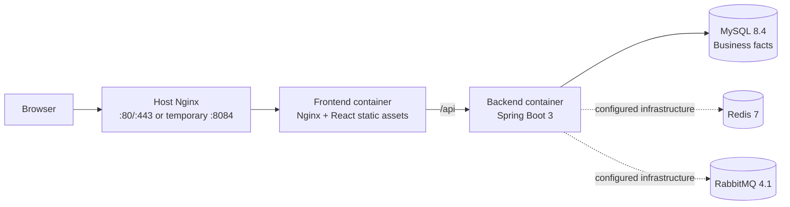

# EventFlow

EventFlow 是一个活动报名与场次配额管理平台。活动创建者可以创建草稿、配置场次与名额、提交审核并发布；普通用户可以浏览公开活动、选择场次报名和取消报名；管理员负责活动审核和下架。

> 项目采用模块化单体架构：React + TypeScript 前端与 Spring Boot 后端分离部署，MySQL 作为业务事实源，Docker Compose 负责运行环境编排。

## 功能概览

- 账号注册、登录、JWT 鉴权、刷新令牌轮换和退出登录。
- 个人资料维护、头像上传、密码修改与刷新令牌批量失效。
- 活动草稿创建与编辑，支持主办方、联系人、地点、报名时间等信息。
- 一个活动可配置多个场次和独立名额；草稿或被驳回活动可以继续编辑和加场次。
- 活动状态流转：`DRAFT -> PENDING_REVIEW -> APPROVED -> PUBLISHED -> OFFLINE`，驳回后回到 `REJECTED` 修改路径。
- 管理员审核、驳回原因、审核历史和下架能力。
- 公开活动广场、报名窗口提示、场次名额展示、我的报名和取消报名。
- 创建者/管理员报名管理：按场次、状态、关键词筛选，支持分页和联系方式脱敏。
- 数据库条件更新和唯一约束防止超卖与重复报名。

## 架构



当前报名主链路直接使用 MySQL 事务和条件更新。Redis 与 RabbitMQ 已作为容器和 Spring 生产配置接入，但尚未用于核心报名流程；它们是通知、缓存、候补或异步任务的后续扩展基础。

详细架构见 [docs/architecture.md](docs/architecture.md)，部署见 [docs/deployment.md](docs/deployment.md)。

## 技术栈

| 范围 | 技术 |
| --- | --- |
| 前端 | React 19、TypeScript、Vite、Ant Design、TanStack React Query、Zustand、Axios |
| 后端 | Java 17、Spring Boot 3.4、Spring Security、MyBatis-Plus、JJWT、Flyway |
| 数据与消息 | MySQL 8.4、Redis 7、RabbitMQ 4.1 |
| 工程质量 | Vitest、Testing Library、JUnit 5、Mockito、Testcontainers、ESLint、Prettier、Spotless、Checkstyle |
| 部署 | Docker Compose、Nginx、腾讯云 CVM |

## 核心业务与数据一致性

活动和报名的关键状态如下：

```text
Activity
DRAFT -> PENDING_REVIEW -> APPROVED -> PUBLISHED -> OFFLINE
  ^            |
  +-------- REJECTED

Registration
CONFIRMED <-> CANCELLED
```

报名时不会采用“先查询剩余名额，再在 Java 中扣减”的方式。场次名额通过 MySQL 条件更新原子扣减：

```sql
UPDATE ef_activity_session
SET available_quota = available_quota - 1,
    confirmed_quota = confirmed_quota + 1
WHERE id = ?
  AND activity_id = ?
  AND status = 'ACTIVE'
  AND available_quota > 0;
```

只有影响行数为 `1` 时才继续创建报名记录；影响行数为 `0` 时返回“名额已满”。同时，`ef_registration` 建立了唯一约束：

```sql
UNIQUE KEY uk_ef_registration_activity_user (activity_id, user_id)
```

因此同一用户只能对同一活动保留一条报名事实。扣减名额和写入/重新激活报名记录在同一个 `@Transactional` 方法中完成，任一步失败都会回滚。

## 快速启动

### 前置条件

- Node.js 22+ 与 pnpm 11+
- Java 17+
- Docker Desktop 或 Docker Engine + Compose Plugin

### 前端开发

```bash
pnpm install
pnpm --dir frontend dev
```

Vite 开发服务器会把 `/api` 代理到 `http://127.0.0.1:8080`。

### 后端开发

复制并按本地环境填写 `backend/config/application-local.yml`，然后执行：

```bash
cd backend
./mvnw spring-boot:run
```

Windows 可使用：

```powershell
cd backend
.\mvnw.cmd spring-boot:run
```

### 常用质量检查

```bash
pnpm --dir frontend typecheck
pnpm --dir frontend test --run
pnpm --dir frontend build

cd backend
./mvnw test
```

## 部署

首次部署、环境变量、Nginx 反代、备份和 HTTPS 见 [docs/deployment.md](docs/deployment.md)。

日常只更新前端时，服务器执行：

```bash
cd /opt/eventflow
git pull origin main
cd deploy
docker compose build frontend
docker compose up -d --no-deps frontend
docker compose ps frontend
```

## 持续集成与手动发布

GitHub Actions 会在推送到 `main`、提交 Pull Request 或手动触发时运行 `.github/workflows/ci.yml`：

- 前端：锁定依赖安装、ESLint、TypeScript 类型检查、Vitest 测试、Vite 生产构建。
- 后端：Java 17 环境下执行 Maven `verify`，覆盖 Checkstyle、测试和打包校验。

CI 只读仓库，不包含 SSH、GitHub Secrets 或自动部署。CI 通过后，可在 GitHub Actions 中手动运行 `Deploy Production`，选择前端、后端或全量发布。该工作流会再次确认当前 `main` 提交的前后端 CI 均成功，再连接腾讯云部署指定版本。首次配置、密钥边界与发布流程见 [CI 与手动发布](docs/ci-cd.md)。

## 项目文档

- [架构与模块边界](docs/architecture.md)
- [部署、更新与回滚](docs/deployment.md)
- [CI 与手动发布](docs/ci-cd.md)
- [原有腾讯云部署说明](deploy/README.md)
- `docs/project/`：产品需求、状态机、接口契约、测试与技术设计资料

## 当前边界与下一步

当前版本已完成活动审核、发布、场次配额、报名取消、资料管理、云端部署、GitHub Actions CI 和手动触发的生产发布。以下方向尚未接入核心业务：候补名单、临时预约超时释放、签到核销、消息通知消费者、公开活动缓存、端到端测试、数据库并发压测和自动部署。

这些能力应在明确业务需求和压测证据后逐步引入，而不是仅为增加技术名词而堆叠。
