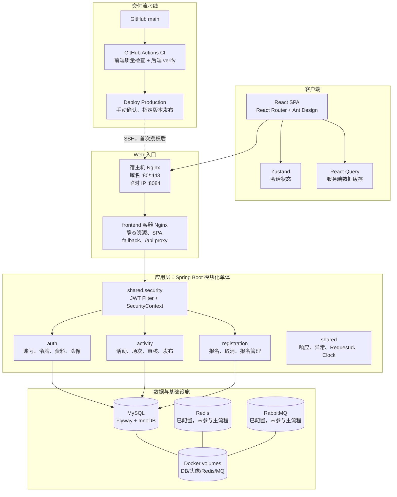
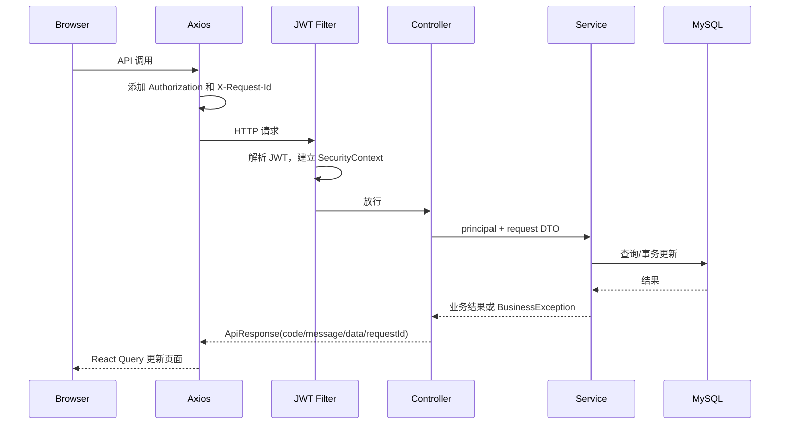
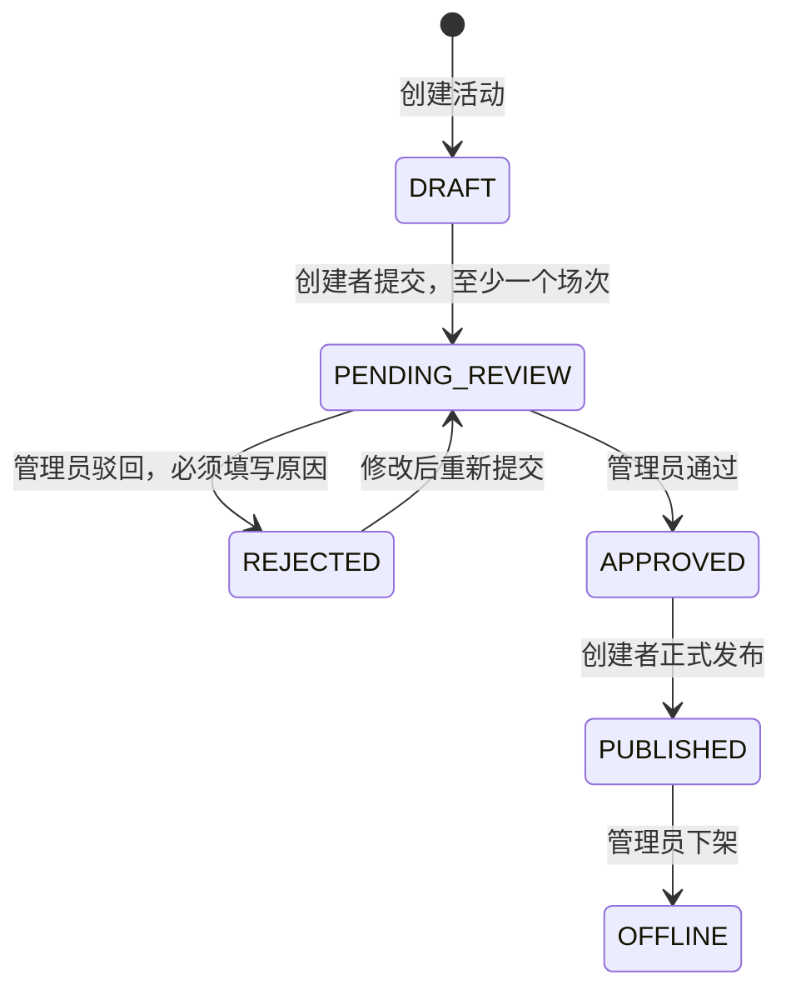
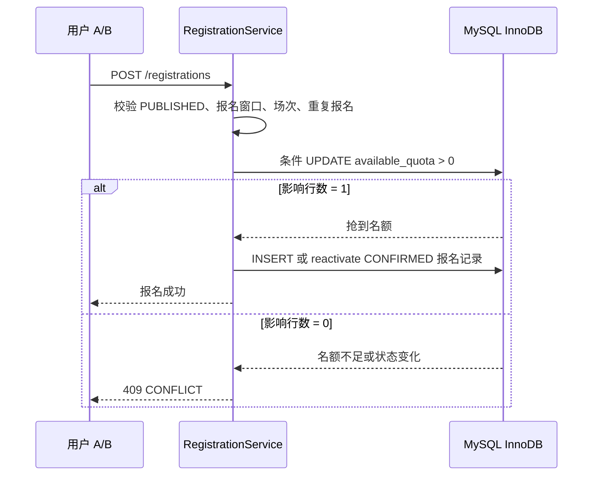

# EventFlow 架构与模块边界

本文描述当前仓库已经实现的架构，不把后续规划当作现有功能。

## 总体架构



代码推送到 `main` 或针对 `main` 的 Pull Request 会自动触发 CI。前端在 pnpm 锁定依赖下执行 ESLint、TypeScript、Vitest 和 Vite 构建；后端在 Java 17 下执行 Maven `verify`，覆盖 Checkstyle、34 项单元测试和可运行 JAR 打包。生产发布是独立的 `workflow_dispatch` 工作流：必须由维护者在 GitHub Actions 勾选确认，且会拒绝未通过前后端 CI 的提交。它不会因 `git push` 自动部署。

## 前端边界

| 目录 | 责任 | 典型文件 |
| --- | --- | --- |
| `app/` | 应用路由、鉴权路由包装、全局外壳 | `App.tsx` |
| `features/auth/` | 登录、注册、当前用户接口、角色默认路由 | `LoginPage.tsx`、`auth-api.ts` |
| `features/activity/` | 活动创建/编辑、场次、提交审核、发布 | `ActivityWorkspace.tsx` |
| `features/participant/` | 公开活动广场、报名、我的报名 | `EventExplorePage.tsx` |
| `features/registration/` | 创建者/管理员报名管理筛选分页 | `ActivityRegistrationsDrawer.tsx` |
| `features/admin/` | 管理员审核和审核记录 | `ActivityReviewPage.tsx` |
| `features/profile/` | 资料、头像、改密 | `ProfileMenu.tsx` |
| `shared/api/` | Axios、统一错误转换、RequestId、401 刷新 | `http-client.ts` |
| `shared/auth/` | Zustand 持久化会话 | `session-store.ts` |

会话状态放在 Zustand；活动、场次、报名等服务端事实放在 React Query。Mutation 成功后通过 `invalidateQueries` 重新获取受影响的数据，避免页面有多份手工同步的副本。

## 后端边界

每个业务域遵循 `api -> application -> domain -> infrastructure/persistence` 的结构：

| 层 | 职责 |
| --- | --- |
| `api` | HTTP 映射、请求 DTO、Bean Validation、响应 DTO。 |
| `application` | 用例编排、事务、状态判断、资源归属和业务规则。 |
| `domain` | `ActivityStatus`、`RegistrationStatus` 等有限状态概念。 |
| `infrastructure/persistence` | MyBatis-Plus 实体和 Mapper；关键并发 SQL 使用显式 `@Update`。 |
| `shared` | JWT、统一错误、统一响应、RequestId、时间配置。 |

Controller 不承担复杂业务逻辑。例如 `RegistrationController.register` 只校验 `activityId/sessionId`、获取 `AuthenticatedPrincipal` 并调用 `RegistrationService.register`；活动是否发布、报名是否结束、是否重复、名额是否足够都在 Service 中判断。

## 认证请求链路



JWT access token 默认 30 分钟；refresh token 默认 7 天。refresh token 是随机值，数据库仅保存 SHA-256 哈希。前端对并发 401 使用共享 `refreshPromise`，避免多个接口同时刷新令牌。

## 关键状态机



创建者仅能编辑和配置 `DRAFT`、`REJECTED` 活动。公开接口只返回 `PUBLISHED` 活动。前端按钮按状态显示，后端 `ActivityService` 再次强制校验，因此不能依靠修改浏览器页面绕过状态机。

## 报名一致性设计



关键 SQL：

```sql
UPDATE ef_activity_session
SET available_quota = available_quota - 1,
    confirmed_quota = confirmed_quota + 1
WHERE id = #{sessionId}
  AND activity_id = #{activityId}
  AND status = 'ACTIVE'
  AND available_quota > 0;
```

报名记录唯一约束：

```sql
UNIQUE KEY uk_ef_registration_activity_user (activity_id, user_id)
```

`RegistrationService.register` 使用 `@Transactional`，将名额扣减与报名插入/重新激活绑定。`ef_activity_session` 还有配额守恒检查：

```text
total_quota = available_quota + reserved_quota + confirmed_quota
```

当前版本仅使用 `available_quota` 和 `confirmed_quota`；`reserved_quota` 为未来临时预约能力预留。

## 数据安全与边界

- 密码使用 BCrypt 哈希，refresh token 只保存哈希。
- 所有需要登录的接口由 Spring Security 拦截；创建者归属和管理员角色在 Service 再校验。
- 头像限制 5MB，校验 Content-Type 和图片魔数，UUID 重命名并防止路径穿越。
- 创建者报名管理对手机号、邮箱做脱敏。
- MySQL、Redis、RabbitMQ 只通过 Docker 内部网络通信；MySQL 仅绑定宿主机回环地址。
- `RequestIdFilter` 生成/传递请求 ID，响应与日志都带 `requestId` 便于排障。

## 当前实现边界

Redis、RabbitMQ 已在 Docker Compose 和生产配置中声明，但没有在当前报名、审核、资料等业务代码中读写。GitHub Actions CI 已验证通过；手动生产发布工作流已实现，待完成首次服务器 SSH 授权与线上发布验证。候补、签到、超时释放、消息通知、缓存、端到端测试和数据库并发压测仍是后续方向，不是当前版本已交付功能。
